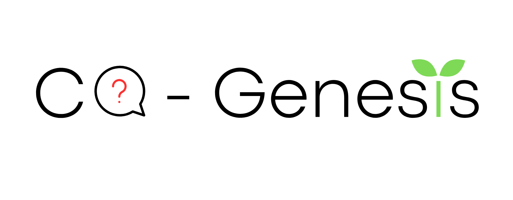

  

<h1 align="center">CQ-Genesis</h1>
<h3 align="center">
  <i>
    LLM-Assisted and Human-Guided 
    Competency Question Generation from Structured Data and User Stories
  </i>
</h3>

CQ-Genesis is a multi-source LLM-based system for eliciting Competency Questions from structured data, user stories, or their combination.

## Features

- Structured dataset input
- User story input
- Multi-source generation
- Pattern-guided few-shot prompting
- Support for proprietary and open-weight LLMs
- Human-in-the-loop review
- Reproducible generation records

## Repository structure

- `frontend/`: Streamlit interface
- `backend/`: generation and profiling services
- `tests/`: automated tests
- `data/examples/`: example inputs
- `docs/`: documentation and figures

## Status

Prototype under active development.
